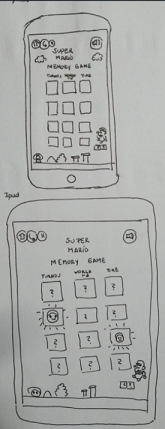

# MEMORY GAME:MARIO BROS.

## Índice

* [1. Resumen del Proyecto](#1-Resumen_del_Proyecto)
* [2. Desarrollar Historias de Usuarios mas Importantes](#2-Desarrollar_Historias_de_Usuarios_mas_Importantes)
* [3. Diseño de Prototipo de Baja , Alta fidelidad y feedback](#3-Diseño_de_Prototipo_de_Baja_,_Alta_fidelidad_y_feedback)
* [4. Test de usabilidad](#4-Test_de_usabilidad)

***

## 1. Resumen del Proyecto

 Una vez  leidos los readmes de los proyectos planteados por los coaches,nos decidimos trabajar en Memory Match, realizamos fork a proyecto de Laboratoria y fork a dupla.Luego de una intensa investigacion sobre metodologías ágiles, dimos inicio a la elaboracion de nuestro proyecto planteandonos las diferentes historias de usuarios priorizando y estableciendo criterios de aceptación ,recabar datos de usuarios de nuestra aplicación.
 
 ¿Quienes son nuestras Usuari@s?
 
 Niñas y niños de un rango de edad entre 7 y 10 años.
 
 ¿Cómo les gustaría que fuera un memorice?
 
 “ Que al momento de conseguir la pareja las cartas alumbren”-Sofía, 8 años.
 
 “ Que tuviera un tiempo decreciente “ -Ivana , 7 años .
 
 “Que tenga sonido” - Ivana, 7 años.
 
 "Que la temática fuera de moda o atractiva".
 
 Diagrama
 
 

  ## 2. Desarrollar Historias de Usuarios mas Importantes

  ### 2.1 "Como jugadora quiero que mis cartas estén barajadas correctamente en cada partida para que el juego sea más entretenido"
  
     Criterios de Aceptación
  
       - Antes de que la usuaria comience a jugar, las cartas deben mostrarse ordenadas en filas y en columnas.
       
       - Cada vez que se inicie una partida debe establecerse un nuevo orden de las cartas.
       
       - La usuaria antes de iniciar la partida debe observar las cartas boca abajo.
       
       - El tablero con las cartas barajadas boca abajo debe estar adaptado a todas las pantallas de los diferentes dispositivos.
       
   ### 2.2" Como jugadora necesito que al formar el par, las cartas se fijen en el tablero para saber cuántos aciertos tengo"
  
       Criterios de Aceptación
   
       - El volteo de cartas debe ser de 2 en 2 en cada turno.
       
       - Las cartas que no coincidan por turno deben voltearse boca bajo inmediatamente.
       
       - Si al voltear dos cartas en el turno  estas coinciden deben desaparecer pero el espacio que ocupaban debe mantenerse en el tablero.
       
       - El tablero con las cartas barajadas boca abajo debe estar adaptado a todas las pantallas de los diferentes dispositivos.
       
       
   ### 2.3" Como usuaria de la aplicación quiero que al momento de voltear las cartas suenen para sea más entretenido juga"
    
       Criterios de Aceptación
   
        - Al momento de voltear cada una de las cartas la usuaria debe percibir un efecto sonoro.
       
        - El efecto sonoro debe tener la misma duración que el volteo de las cartas.
       
        - Al hacer match debera tener un efecto sonoro diferente al efecto  de voltear las cartas.
        
        
   ### 2.4" Como jugadora quiero que se me avise cuando gane "
    
       Criterios de Aceptación
   
        - La usuaria acabará con la partida cuando este el tablero vacio en su totalidad.
       
        - Debe haber un punto por cada match.
       
        - Se debe mostrar un mensaje de felicitaciones cuando haya finalizado el juego..
       
       
     

  ## 3. Diseño de Prototipo de Baja , Alta fidelidad y feedback

  ### 3.1 Prototipo de Baja Fidelidad

  
  
  
   ### FEEDBACK
   Temática agradable.
   Los iconos fueron fácilmente identificados, a excepción del icono de ayuda.
   De igual manera se nos sugirió aplicar opcion de ayuda pero con imagenes.

   ### 3.2. Prototipo de Alta Fidelidad
  Partiendo de ambos modelos desarrollados, se obtuvo el siguiente esquema, que muestra el funcionamiento de la app.
  
   
   
   

 
  

## 4. Test de Usabilidad

Para realizar pruebas con usuari@s reales, le pedimos a dos niñas con edades de 7 y 9 respectivamente con edades que utilizaran la aplicación web, dandole como instrucción "utiliza esta página". Los resultados se muestran a continuación considerando tres criterios que se habian definido previamente para la observación.

